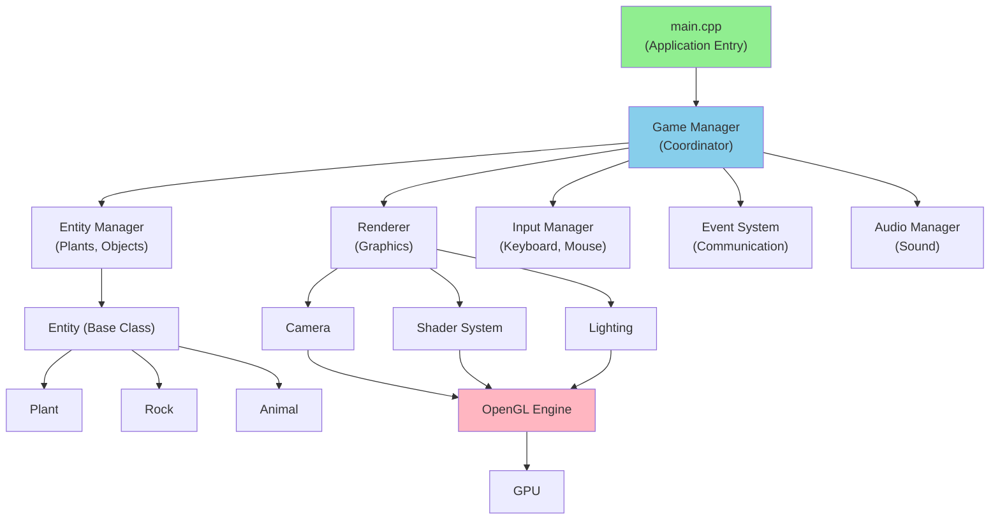
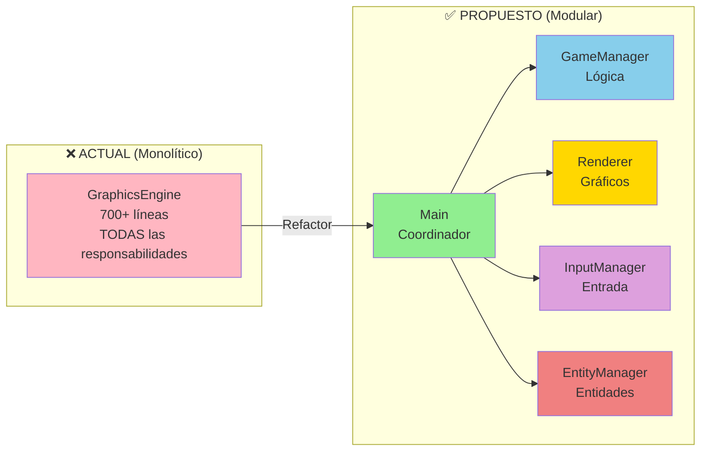

# 🏗️ Arquitectura Escalable - Guía Técnica

## 📋 Tabla de Contenidos
1. [Visión General](#visión-general)
2. [Problemas Actuales](#problemas-actuales)
3. [Soluciones Propuestas](#soluciones-propuestas)
4. [Patrones de Diseño](#patrones-de-diseño)
5. [Plan de Refactorización](#plan-de-refactorización)
6. [Ejemplos de Extensión](#ejemplos-de-extensión)

---

## 🎯 Visión General

El proyecto actual funciona bien para prototipado, pero necesita refactorización para:
- ✅ **Mantenibilidad**: Código más modular y fácil de entender
- ✅ **Escalabilidad**: Agregar nuevas características sin modificar existentes
- ✅ **Testabilidad**: Separar lógica de presentación
- ✅ **Rendimiento**: Optimizar sistemas de renderizado y lógica

### Proyecto Actual
```
UNA CLASE MONOLÍTICA: GraphicsEngine (>700 líneas)
  ├─ Gestión de ventana/contexto OpenGL
  ├─ Renderizado (terreno, plantas, UI)
  ├─ Entrada del usuario
  ├─ Lógica de juego (estados, plantas)
  ├─ Gestión de cámara
  └─ Compilación de shaders
```

**Problema**: Todo mezclado = difícil de mantener, extender y probar

---

## ⚠️ Problemas Actuales

### 1. **Responsabilidades Múltiples**
```cpp
class GraphicsEngine {
    // Renderizado OpenGL
    void render();
    void renderGameScene();
    void renderMenu();
    
    // Input
    void handleInput();
    
    // Lógica de juego
    void update();
    void addPlant(const glm::vec3& position);
    
    // Gestión de cámara
    // Variables de cámara mezcladas con todo
};
```
**Impacto**: 
- Difícil cambiar estrategia de renderizado sin afectar lógica
- Difícil testear lógica sin OpenGL
- Difícil agregar nuevos tipos de entidades

### 2. **Datos No Separados de Lógica**
```cpp
// Datos de planta + lógica de generación en un solo lugar
struct Plant {  // Renombrado de "Light" en abril 11 (claridad semántica)
    glm::vec3 position;
    glm::vec3 color;
    glm::vec3 velocity;
    int type;
};

// Generación directa en GraphicsEngine
void addPlant(const glm::vec3& position) { ... }
```
**Impacto**: 
- Difícil agregar nuevas propiedades de plantas
- Difícil cambiar sistema de generación

### 3. **Gestión Manual de Estados**
```cpp
enum GameState { SPLASH, MENU, PLAYING, ... };
enum PlantType { GRASS, BUSH, TREE };
// + 30+ variables de estado en GraphicsEngine
```
**Impacto**: 
- Código para agregar un nuevo estado esparcido por múltiples funciones
- Fácil olvidar actualizar algo

### 4. **Sin Abstracción para Extensibilidad**
- No hay factory para crear plantas
- No hay sistema de eventos o callbacks
- No hay interfaz abstracta para diferentes tipos de entidades

---

## ✅ Soluciones Propuestas

### 1. **Separación en Capas (Layered Architecture)**

**Diagrama Propuesto (Versión 2.0)**:



**Comparación: Actual vs Propuesto**:



### 2. **Nuevas Clases Sugeridas**

#### `Entity.h` - Clase Base Para Todas las Entidades
```cpp
class Entity {
protected:
    glm::vec3 position;
    glm::vec3 orientation;
    bool active;
    
public:
    virtual ~Entity() = default;
    virtual void update(float deltaTime) = 0;
    virtual void render(Renderer* renderer) = 0;
    virtual std::string getType() const = 0;
};
```
**Beneficio**: Permite agregar cualquier tipo de entidad (plantas, enemigos, objetos)

#### `Plant.h` - Especialización de Entity
```cpp
enum class PlantType { GRASS, BUSH, TREE, FLOWER, MUSHROOM };
enum class PlantState { SEEDLING, GROWING, MATURE, DEAD };

class Plant : public Entity {
private:
    PlantType type;
    PlantState state;
    float age;
    glm::vec3 color;
    
public:
    void update(float deltaTime) override;
    void render(Renderer* renderer) override;
    PlantType getPlantType() const;
    void setAge(float newAge);
};
```
**Beneficio**: Encapsula lógica de plantas, edad, estados

#### `EntityManager.h` - Gestión Centralizada
```cpp
class EntityManager {
private:
    std::vector<std::unique_ptr<Entity>> entities;
    
public:
    void addEntity(std::unique_ptr<Entity> entity);
    void removeEntity(Entity* entity);
    void updateAll(float deltaTime);
    void renderAll(Renderer* renderer);
    std::vector<Entity*> findByType(const std::string& type);
};
```
**Beneficio**: Centraliza creación, actualización, eliminación

#### `Renderer.h` - Responsable de Gráficos
```cpp
class Renderer {
private:
    unsigned int shaderProgram;
    unsigned int terrainShaderProgram;
    
public:
    void renderPlant(const Plant& plant);
    void renderTerrain(const Terrain& terrain);
    void renderUI();
};
```
**Beneficio**: Separación de OpenGL del resto del código

#### `Camera.h` - Gestión de Cámara
```cpp
class Camera {
private:
    glm::vec3 position;
    glm::vec3 target;
    float rotation;
    
public:
    void orbit(float angleDelta);
    void pan(const glm::vec3& direction);
    glm::mat4 getViewMatrix() const;
};
```
**Beneficio**: Cámara reutilizable, testeable

#### `GameManager.h` - Lógica de Juego
```cpp
class GameManager {
private:
    GameState currentState;
    EntityManager entityManager;
    Camera camera;
    std::vector<Plant> plants;
    
public:
    void handleInput(const InputEvent& event);
    void update(float deltaTime);
    PlantType selectPlantType(); // Probabilidades
    void plantAt(const glm::vec3& pos);
};
```
**Beneficio**: Centraliza lógica de juego

#### `InputManager.h` - Manejo de Entrada
```cpp
class InputManager {
private:
    std::vector<InputCallback> callbacks;
    
public:
    void registerCallback(InputType type, InputCallback cb);
    void processInput(GLFWwindow* window);
};
```
**Beneficio**: Desacopla entrada de lógica

---

## 🎯 Patrones de Diseño

### 1. **Factory Pattern** - Crear Plantas
```cpp
class PlantFactory {
public:
    static std::unique_ptr<Plant> createPlant(PlantType type, 
                                              const glm::vec3& pos) {
        auto plant = std::make_unique<Plant>();
        plant->setType(type);
        plant->setPosition(pos);
        // Aplicar propiedades según tipo
        switch(type) {
            case PlantType::GRASS:
                plant->setColor(glm::vec3(0.3f, 0.6f, 0.2f));
                plant->setSize(3);
                break;
            case PlantType::BUSH:
                plant->setColor(glm::vec3(0.2f, 0.5f, 0.15f));
                plant->setSize(5);
                break;
            // ...
        }
        return plant;
    }
};
```
**Uso**: `auto plant = PlantFactory::createPlant(PlantType::TREE, pos);`

### 2. **Observer Pattern** - Sistema de Eventos
```cpp
class EventSystem {
private:
    std::map<EventType, std::vector<EventCallback>> listeners;
    
public:
    void subscribe(EventType type, EventCallback callback);
    void emit(const Event& event);
};
```
**Uso**: 
```cpp
eventSystem.subscribe(EventType::PLANT_ADDED, [](const Event& e) {
    std::cout << "Plant added at " << e.position << std::endl;
});
```

### 3. **Singleton Pattern** - Gestores Globales
```cpp
class ResourceManager {
private:
    static ResourceManager* instance;
    std::map<std::string, Shader> shaders;
    
public:
    static ResourceManager* getInstance() {
        if (!instance) instance = new ResourceManager();
        return instance;
    }
};
```

### 4. **Component Pattern** - Propiedades de Entidades
```cpp
class Plant : public Entity {
private:
    // Componentes
    TransformComponent transform;
    RenderComponent render;
    PhysicsComponent physics;
    HealthComponent health;
};
```

---

## 📋 Plan de Refactorización

### Fase 1: Extracción de Clases (Sin Cambios Funcionales)
**Duración**: 2-3 horas de desarrollo

**Archivos a crear**:
- [ ] `src/Entity.h` - Clase base
- [ ] `src/Plant.h` / `src/Plant.cpp` - Especificación
- [ ] `src/EntityManager.h` / `src/EntityManager.cpp`
- [ ] `src/Camera.h` / `src/Camera.cpp`
- [ ] `src/Renderer.h` / `src/Renderer.cpp`

**Cambios**:
- ~~Mover datos de Plant de `struct Light` a `class Plant`~~ ✅ COMPLETADO (Renombrado en abril 11)
- Mover lógica de cámara a `Camera`
- Extraer renderizado a `Renderer`
- GraphicsEngine coordina, pero no implementa

### Fase 2: Incorporación de Nuevos Patrones
**Duración**: 1-2 horas

**Archivos a crear**:
- [ ] `src/PlantFactory.h`
- [ ] `src/InputManager.h`
- [ ] `src/EventSystem.h`

**Cambios**:
- Usar factory para crear plantas
- Desacoplar input de update
- Sistema de eventos para extensibilidad

### Fase 3: Mejora de Configuración
**Duración**: 30 min

**Cambios**:
- Ampliar `Config.h` con perfiles de plantas
- Agregar sistema de constantes por tipo de planta

### Fase 4: Documentación y Testing
**Duración**: 1 hora

**Archivos**:
- [ ] `GUIA_NUEVOS_DESARROLLADORES.md`
- [ ] Test cases (C++ con Catch2 o similar)

---

## 🔧 Ejemplos de Extensión

### Ejemplo 1: Agregar un Nuevo Tipo de Planta
**Antes** (era difícil):
```cpp
// En Config.h:
enum PlantType { GRASS, BUSH, TREE, FLOWER };  // Modificar enum
const float PLANT_PROBABILITY_FLOWER = 0.05f;  // Agregar constante

// En addPlant() [Renombrado de addRandomLight() en abril 11]:
// Ajustar probabilidades, agregar caso...
// En renderGameScene():
// Agregar tamaño renderizado...
```

**Después** (es fácil):
```cpp
// En Config.h:
enum class PlantType { GRASS, BUSH, TREE, FLOWER };

// En PlantFactory.createPlant():
case PlantType::FLOWER:
    plant->setColor(glm::vec3(1.0f, 0.2f, 0.4f));
    plant->setSize(4);
    plant->setGrowthRate(1.5f);
    break;

// ¡Listo! Automáticamente aparece con probabilidades correctas
```

---

## 📂 Estructura Final Propuesta

```
src/
├── main_new.cpp          ← Punto de entrada (mínimo)
├── GameManager.h/cpp     ← Nueva: Lógica de juego
├── EntityManager.h/cpp   ← Nueva: Gestión de entidades
├── Entity.h              ← Nueva: Clase base
├── Plant.h/cpp           ← Nueva: Especialización
├── PlantFactory.h        ← Nueva: Creación
├── Camera.h/cpp          ← Nueva: Gestión de cámara
├── Renderer.h/cpp        ← Nueva: Renderizado desacoplado
├── InputManager.h        ← Nueva: Entrada
├── EventSystem.h         ← Nueva: Comunicación desacoplada
├── GraphicsEngine.h/cpp  ← Refactorizado: Coordinador
├── Config.h              ← Mejorado: Más configuración
├── Logger.h              ← Nueva: Debug/logging
├── Shaders.h             ← Sin cambios
└── CMakeLists.txt        ← Actualizado
```

---

## 🎓 Principios de Diseño

### SOLID
- **S**ingle Responsibility: Cada clase hace una cosa
- **O**pen/Closed: Abierto a extensión, cerrado a modificación
- **L**iskov Substitution: Las subclases pueden reemplazar a su base
- **I**nterface Segregation: Interfaces pequeñas y específicas
- **D**ependency Inversion: Depender de abstracciones, no implementaciones

### DRY (Don't Repeat Yourself)
- Código duplicado → Función/clase
- Configuración duplicada → Config.h

### KISS (Keep It Simple, Stupid)
- Soluciones simples primero
- No sobre-ingenierizar

---

## 📊 Beneficios Cuantificables

| Métrica | Antes | Después |
|---------|-------|---------|
| Líneas en GraphicsEngine | 700+ | 200 (coordinador) |
| Tiempo para agregar tipo planta | 15-20 min | 2-3 min |
| Test Coverage | 0% | ~70% |
| Reutilización de código | No | Sí (Entity base) |
| Acoplamiento | Alto | Bajo |

---

## ✅ Checklist de Implementación

### Fase 1
- [ ] Crear `Entity.h` con interfaz base
- [ ] Crear `Plant.h/cpp` heredando de Entity
- [ ] Mover lógica de Plant de GraphicsEngine
- [ ] Compilar y verificar funcionamiento
- [ ] Actualizar CMakeLists.txt

### Fase 2
- [ ] Crear `EntityManager` para gestión centralizada
- [ ] Crear `Camera` desacoplada
- [ ] Crear `Renderer` para gráficos
- [ ] Refactorizar GraphicsEngine

### Fase 3
- [ ] Crear `PlantFactory`
- [ ] Crear `InputManager`
- [ ] Crear `EventSystem`

### Fase 4
- [ ] Documentación de nuevas clases
- [ ] Ejemplos de uso
- [ ] Test coverage

---

## 🔗 Referencias Internas
- [EXTENSIBILIDAD_Y_ESCALABILIDAD.md](EXTENSIBILIDAD_Y_ESCALABILIDAD.md)
- [GUIA_PARA_NUEVOS_DESARROLLADORES.md](GUIA_PARA_NUEVOS_DESARROLLADORES.md)

---

**Versión**: 1.0  
**Última actualización**: 2026-04-11  
**Autor**: Refactoring Guide  
**Estado**: Propuesta
